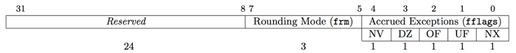

# RV32Zfinx FPU Integration Note

## 1. Motivation and Integration Plan

To enhance my RV32IM-based SoC with lightweight floating-point capability, I integrated the Zurich CVFPU using the RV32Zfinx extension. Unlike traditional RV32F which uses a separate floating-point register file, Zfinx enables reuse of the integer register file (`x0–x31`) for floating-point operations. This reduces hardware complexity and simplifies toolchain and ABI compatibility.

I approached the integration in three phases:

1. **RV32Zf performance evaluation** - Evaluate with spike for the potential and benefits floating point instructions may bring.
2. **Standalone validation** – Verify CVFPU's functionality and interface behavior using a unit testbench.
3. **SoC integration** – Insert CVFPU into the pipeline EX stage, modify the decoder for RVF instruction support, and build an RV32IMF test platform.

## 2. CVFPU Design Overview and Parameterization

[CVFPU github repo](https://github.com/openhwgroup/cvfpu) 

CVFPU is a modular, highly configurable floating-point unit developed by ETH Zurich. I customized it to fit RV32Zfinx with the following key parameters:

* `FLEN = 32` for RV32F scalar operation
* NaN-boxing, SIMD, and tagging: disabled
* Enabled operation groups:

  * `ADDMUL`, `DIVSQRT`,`NONCOMP`, `CONV`
* `PipeRegs` and `PipeConfig` tailored for latency control:

  * PipeRegs: 2, PipeConfig: DISTRIBUTED

## 3. SoC Integration Highlights

### 3.1 RTL Reorganization and Test Framework

* Built test framework (Makefile-based)
* Verified correctness with unit tests and riscv-tests (RVF subset)
  (tbd: image for testbench design)

### 3.2 Pipeline integration

* In-house RV core is a 5-stage pipeline system
  (tbd: illustration of RV core 5-stage pipeline)

#### 3.2.1 Execution stage: Map Zf op-code to CVFPU ctrl signals - Interface remapping

* Mapped decoder output signals to CVFPU control signals
* Add Zfinx op codes into legal op code list for illegal op code test
* Read 3 regs value from reg files due to Zfinx contain operations with 3 rs (FMADD, FMSUB, FNMADD, FNMSUB)
* Used handshaking (`valid`/`ready`) for timing coordination

**FSM and CVFPU Control Logic**
To manage CVFPU latency and interface handshakes, an FSM was introduced:

* **FSM States:** IDLE → BUSY → DONE
* **Controlled Signals:** CVFPU valid/ready, EX stage stall

#### 3.2.2 Write-back stage: Flag for FPU output

* Add flag to distinguish FPU output and ALU/DIV/MUL output
* Extended pipeline hazard logic to account for floating-point reads/writes

#### 3.2.3 FCSR: Zicsr-Compatible FCSR Implementation

To support floating-point control under Zfinx, I implemented fcsr as a standard CSR with full compatibility to the Zicsr extension. The fcsr CSR contains three fields:

* `fflags`: exception flags (W1C style)
* `frm`: rounding mode (dynamic)
* `fcsr`: combined view of the above
  (tbd: image of fcsr)

### 3.3 Exception and Trap Debugging During Decoder Modifications

During decoder integration, multiple issues were resolved:

* **Illegal instruction trap:** opcode missing in legality check
* **Trap return with incorrect `ra`:** uninitialized `ra` after trap
* **Misaligned load/store:** test program bug with unaligned access

### 3.4 Integration Fixes and Synthesis Insights

**Critical Path Analysis & CVFPU Pipeline:**

`PipeRegs` and `PipeConfig` are parameters used to determine pipeline depth and the placement of registers inside the CVFPU. I experimented with multiple settings:

* `BEFORE/1`: Registers placed before main pipeline stages
* `INSIDE/1`: Registers distributed within main logic
* `DISTRIBUTED/2`: Pipelining spread across stages

I adopted `DISTRIBUTED/2`, which passed all direct tests.
> Note: Synthesis was performed using TSMC 65nm technology.
For confidentiality, exact timing slack numbers have been removed (de-identified).

**Linker Script Bug (Branch to Unknown):**

* Uninitialized `__malloc_current_mallinfo` caused unknown branch addr
* Root cause: `__malloc_current_mallinfo` in `.bss.*` was not zero-initialized
* Fix: Modify linker script to include `.bss.*` in `.bss` initialization
* Confirmed fix via `nm`, `readelf`, waveform debug

**Pipeline Integrating issues**
* Refer to [issue-record.md](issue-record.md)

## 4. Summary Tables

### Functional Highlights

| Aspect              | Description                                                 |
| ------------------- | ----------------------------------------------------------- |
| Zfinx integration   | Used x-regs instead of f-regs to reduce hardware complexity |
| FCSR & Zicsr        | Full support for CSR operations and `fflags`/`frm` control  |
